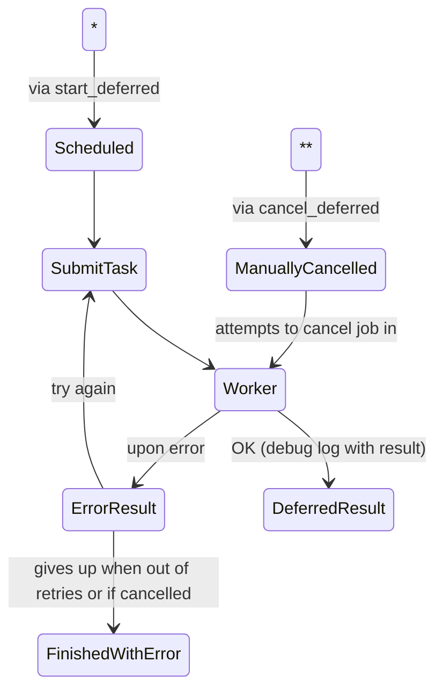

### Steps
- `Scheduled`: triggered by `start_deferred` and creates a TASK
- `SubmitTask`: decreases retry counter
- `Worker`: checks if slots are available (can refuse task), invokes `run_deferred` code and saves the result. Only state in which local state is used (to run the task).
- `ErrorResult`: checks if it can retry the gives up
- `FinishedWIthError`: logs error, invokes `on_finished_with_error` and removes the TASK
- `DeferredResult`: invokes `on_deferred_result` and removes the TASK
- `ManuallyCancelled`: attempts to cancel a local task, NACK message if cannot find task. After 100 attempts it gives up. Cancellation attempts are limited to avoid concurrency issues if the worker finished before this request can be processed.
